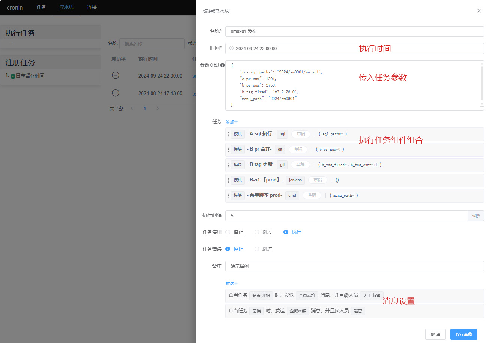

# cronin 服务器任务管理平台

### 介绍
cronin 是一个基于 Go 语言开发的服务器任务管理平台，支持定时任务、流水线任务及 Webhook 接收任务，适用于多种场景。平台提供了可视化界面，方便用户进行任务配置、监控、日志查看等操作。

### 特点
- 多任务类型支持：HTTP、GRPC、Shell、MySQL、Clickhouse、Jenkins、Gitee/Github。
- 权限管理：完善的权限控制系统，确保任务安全。
- 流水线任务：支持多个任务组合流水线，实现任务间的依赖关系。
- Webhook：可以设置接收外部系统的 Webhook，触发特定任务。
- 任务日志追踪：详细记录每次任务执行的日志，便于问题排查。
- 支持多种数据源：MySQL、ClickHouse、SQLite、Jenkins、Gitee/GitHub API。
- 丰富的前端组件：基于 Element UI 构建，提供良好的交互体验。

### 功能
- 多命名空间，区分不同开发环境任务，各自独立管理避免混淆
- 支持多种任务种类：http请求、cmd/shell脚本、grpc请求、sql执行、jenkins构建、多任务组合流水线
- 支持gitee远程仓库拉取脚本执行。
- 支持corn周期循环语法，定时单次脚本类型任务。
- 链路式任务日志信息；自定义通知模板设置对任务状态进行消息通知。
- 用户和角色管理、系统设置和偏好调整


### 功能预览
>命名空间&任务展示
>


>远程服务器执行sh脚本
>


>git拉取仓库sql语句脚本执行
>


>执行日志
>


>流水线任务
>



### 文档
#### 手册
* [任务设置](./work/config_set.md)
* [流水线设置](./work/pipeline_set.md)
* [人员设置](./work/user_set.md)
* [消息设置](./work/message_template_set.md)
* [链接设置](./work/source_set.md)
* 环境设置


#### 博文
* [如何实现jenkins、sql、redis、git等工具的一体化自动发布？](https://juejin.cn/post/7416270933790228495)
* [tapd与cronin对接实现自动发bug单](https://my.oschina.net/mnyuan/blog/16570220)


### 安装
#### 一、 获取程序包
- 方式1：下载编译包(优选)

进入 [releases](https://gitee.com/mnyuan/cronin/releases) 根据服务器型号选择编译包下载。

- 方式2：手动编译
- - main.version 参数为指定的版本号。
- - main.isBuildResource 参数为是否打包静态资源文件，建议true。
~~~
# 编译命令
go build -ldflags "-X main.version=v0.xx -X main.isBuildResource=true" -o cronin.xx ./main.go
~~~

#### 二、 完善配置
项目启动时将寻找当前需要准备`./configs/database.yaml`数据库配置文件、`./configs/main.yaml`主配置文件。

#### 三、 运行
```
./cronin.xx
```
入口页地址： http://127.0.0.1:9003/

默认账号：root / 123456

演示地址：http://cronin.mnyuan.com/login


### 捐助与支持
如果您觉得我的开源软件对你有所帮助请关注、star、fork。

如发现bug、更优的实现方案可提交PR或新建[issue](https://gitee.com/mnyuan/cronin/issues)

### 参与贡献
欢迎参与 cronin 的开发与文档完善：
1. Fork 本项目至你的Git账户
2. Git Clone 到本地到本地仓库
3. checkout 到 bugfix/xxx 分支
4. 在本地仓库中编写代码并测试
5. Push 已经 commit 的代码至远程仓库
6. 新建 Pull Request