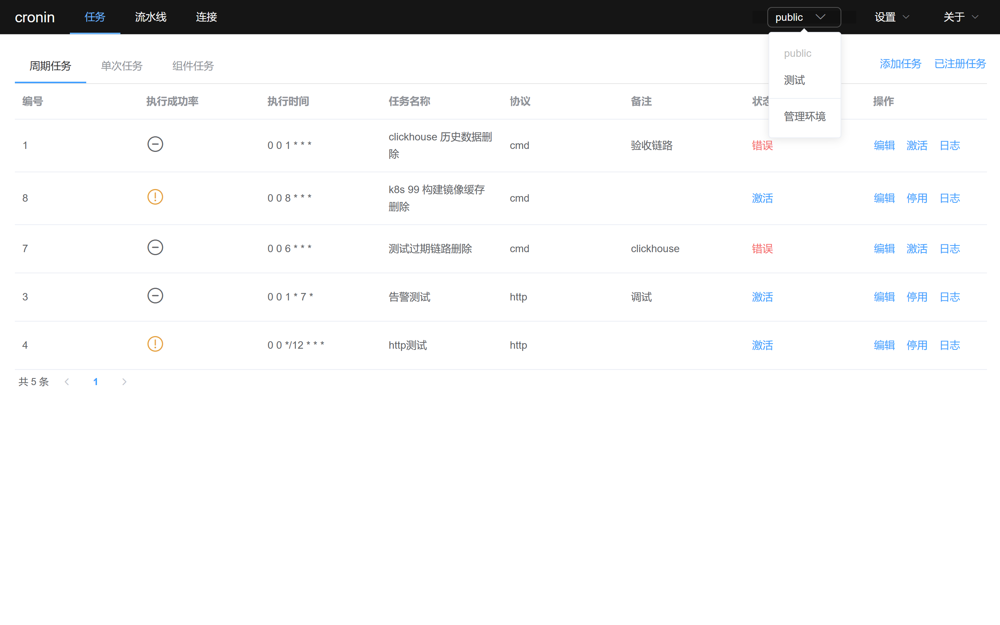
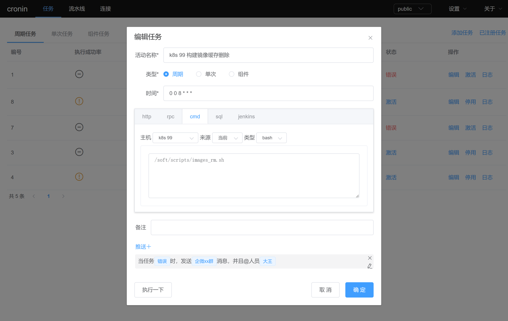
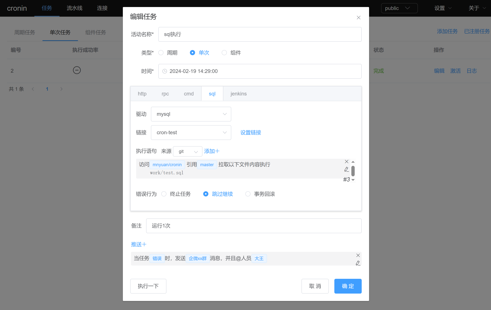
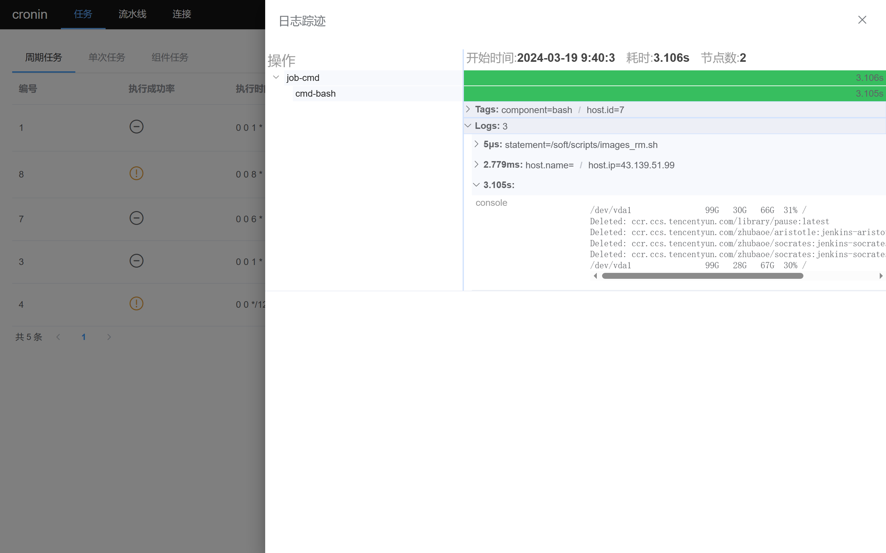

# cronin 服务器任务管理平台

### 介绍
cronin 是企业内部任务管理平台，支持linux、windows服务器；具有统一维护、日志监控、告警监控、任务重放、自动化等优势，让任务管理维护变得简单。

### 特点
* 二进制单文件程序，无任何依赖，开箱及用
* 统一的任务管理方案，让开发专注于业务

### 功能
1. 多命名空间，区分不同开发环境任务，各自独立管理避免混淆
2. 支持多种任务种类：http请求、cmd/shell脚本、grpc请求、sql执行、jenkins构建、多任务组合流水线
3. 支持gitee远程仓库拉取脚本执行。
4. 支持corn周期循环语法，定时单次脚本类型任务。
5. 链路式任务日志信息；自定义通知模板设置对任务状态进行消息通知。


### 功能预览
>命名空间&任务展示
>


>远程服务器执行sh脚本
>


>git拉取仓库sql语句脚本执行
> 


>执行日志
>


>流水线任务
>


### 文档
* [任务设置](https://gitee.com/mnyuan/cronin/blob/master/work/config_set.md)
* 流水线设置
* [人员设置](https://gitee.com/mnyuan/cronin/blob/master/work/user_set.md)
* [消息设置](https://gitee.com/mnyuan/cronin/blob/master/work/message_template_set.md)
* [链接设置](https://gitee.com/mnyuan/cronin/blob/master/work/source_set.md)
* 环境设置


### 安装
#### 一、 获取程序包
- 方式1：下载编译包(优选) 
    
进入 [releases](https://gitee.com/mnyuan/cronin/releases) 根据服务器型号选择编译包下载。

- 方式2：手动编译
- - main.version 参数为指定的版本号。
- - main.isBuildResource 参数为是否打包静态资源文件，建议true。
~~~
# 编译命令
GOOS=linux go build -ldflags "-X main.version=v0.xx -X main.isBuildResource=true" -o cronin.xx ./main.go
~~~

#### 二、 完善配置
项目启动时将寻找当前需要准备`./configs/database.yaml`数据库配置文件、`./configs/main.yaml`主配置文件。

#### 三、 运行
```
./cronin.xx
```
入口页地址： http://127.0.0.1:9003/

默认账号：root / 123456

演示地址：http://cronin.mnyuan.com/login


### 捐助与支持
如果您觉得我的开源软件对你有所帮助请关注、star、fork。

如发现bug、更优的实现方案可提交PR或新建[issue](https://gitee.com/mnyuan/cronin/issues)

#### 参与贡献
1. Fork 本项目至你的Gitee账户
2. Git Clone 到本地到本地仓库
3. checkout 到 bugfix/xxx 分支
4. 在本地仓库中编写代码并测试
3. Push 已经 commit 的代码至远程仓库
4. 新建 Pull Request