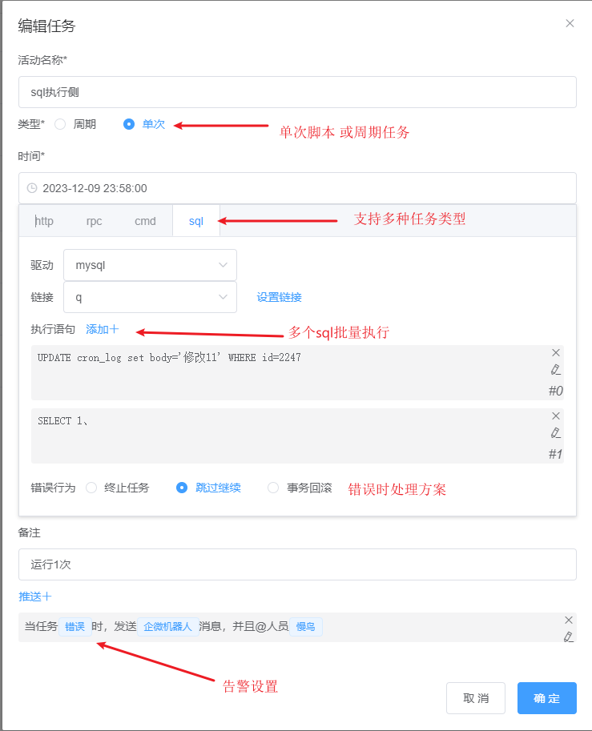
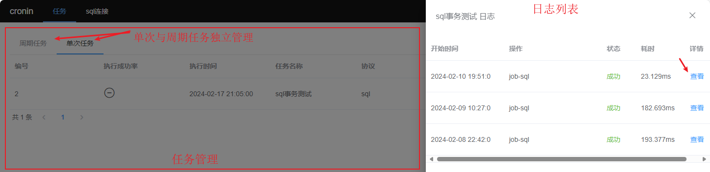
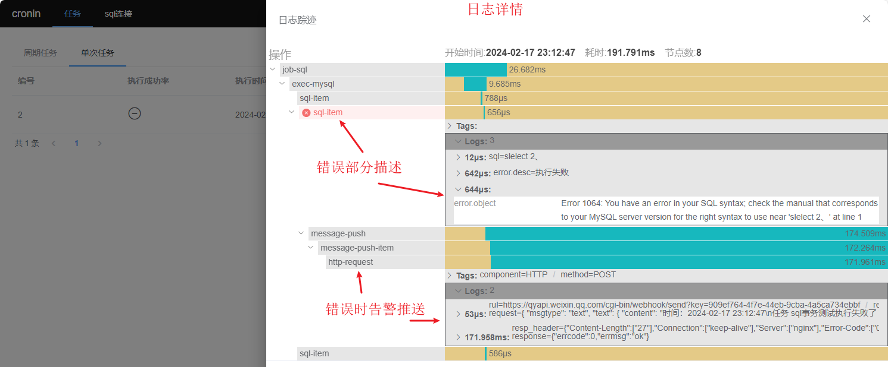

# cronin 服务器定时任务

### 介绍
linux、windows服务器定时任务管理平台。

cronin 采用网页的形式对定时任务管理设置；多命名空间，为不同开发环境设置专属任务。

支持http请求、cmd/shell脚本、grpc请求、sql脚本种类的任务进行设置；

支持周期循环任务和单次脚本类型任务。

完善的任务日志核查执行情况；动态通知模板灵活设置。


### 安装教程
#### 一 获取程序包
- 方式1：下载编译包(优选) 
    
进入 [releases](https://gitee.com/mnyuan/cronin/releases) 根据服务器型号选择编译包下载。

- 方式2：手动编译
- - main.version 参数为指定的版本号。
- - main.isBuildResource 参数为是否打包静态资源文件，建议true。
~~~
# 编译命令
GOOS=linux go build -ldflags "-X main.version=v0.xx -X main.isBuildResource=true" -o cronin.xx ./main.go
~~~

#### 二 完善配置
项目启动时将寻找当前需要准备`./configs/database.yaml`数据库配置文件、`./configs/main.yaml`主配置文件。

#### 三 运行
```
./cronin.xx
```

#### 使用说明

1.  入口页地址： http://127.0.0.1:9003/
2.  设置自己的任务

日志列表

日志详情


