# 任务设置
任务执行的基础单元。

### 通用基础
所有任务都有一些基础信息需要填写：任务名称（必填）、执行类型（必填）、执行时间（必填）、备注（可选）、推送信息（可选）；
其中任务时间根据执行类型不同会有所变化：周期类型使用crontab语法时间（秒 分 时 天 月 星期）、单次类型使用YYYY-mm-dd HH:ii:ss时间格式、组件类型没有时间。
还有就是推送消息可以设置多条。

> 任务基础信息设置

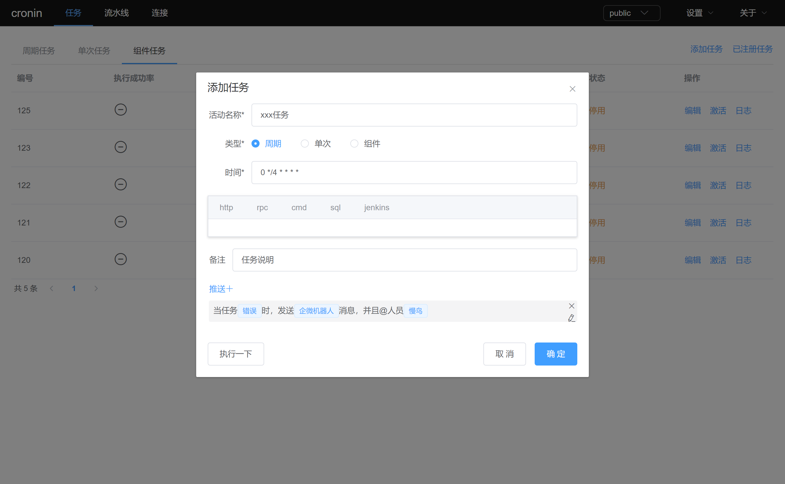

> 消息设置

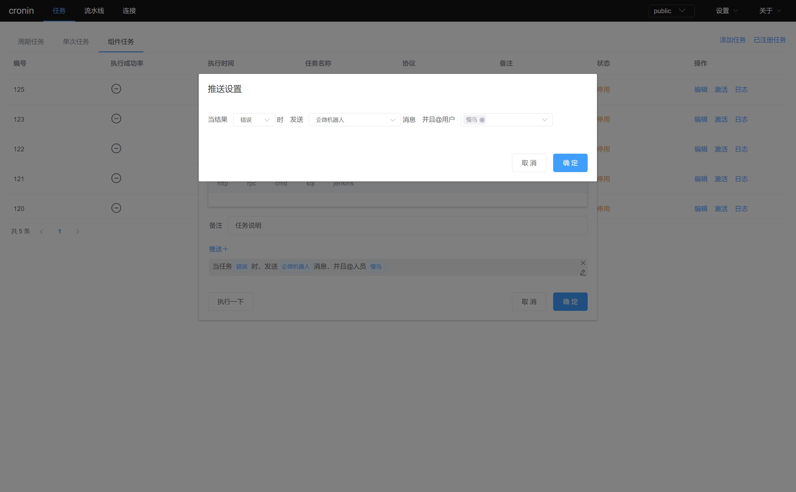


### http任务
http任务需要设置请求地址url（必填）、请求头（可选）、请求body（可选）。
由于http接口有被外网访问的风险，所以还需注意安全措施。
> http任务设置

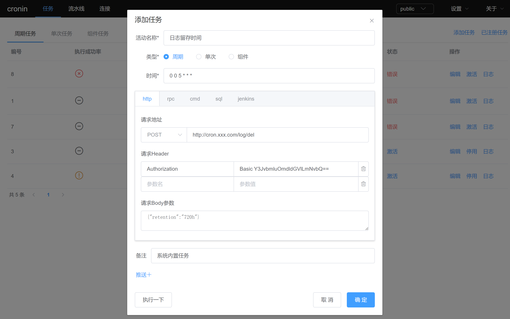


### rpc任务
grpc任务需要定义.proto文件（仅保留调用需要部分即可）、请求地址ip:port端口、请求方法（proto填写后点击解析后可选）、请求参数。
建议将服务放在与grpc服务器内网环境中，这样就可调用内网服务地址。
> grpc任务设置

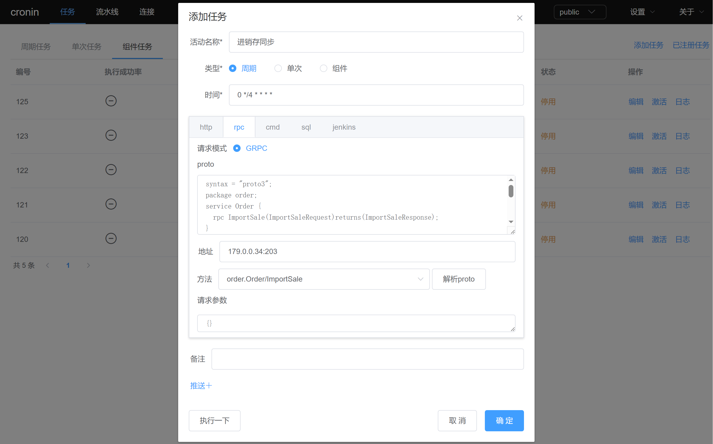
> proto语法样例
```protobuf
syntax = "proto3";
package order;
service Order {
  rpc ImportSale(ImportSaleRequest)returns(ImportSaleResponse);
}
message ImportSaleRequest{
  string start_date = 2;
  string end_date = 3;
}
message ImportSaleResponse{
  int64 count = 1;
}
```


### shell命令行任务
shell脚本内容可直接在表单中填写、可执行远程主机写好的.sh文件、也可拉取git项目中的.sh脚本文件执行。
> 远程主机执行脚本文件配置

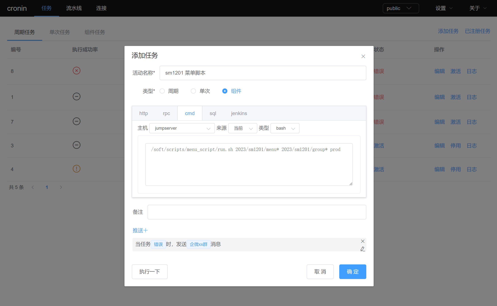

> 本机执行git配置脚本文件

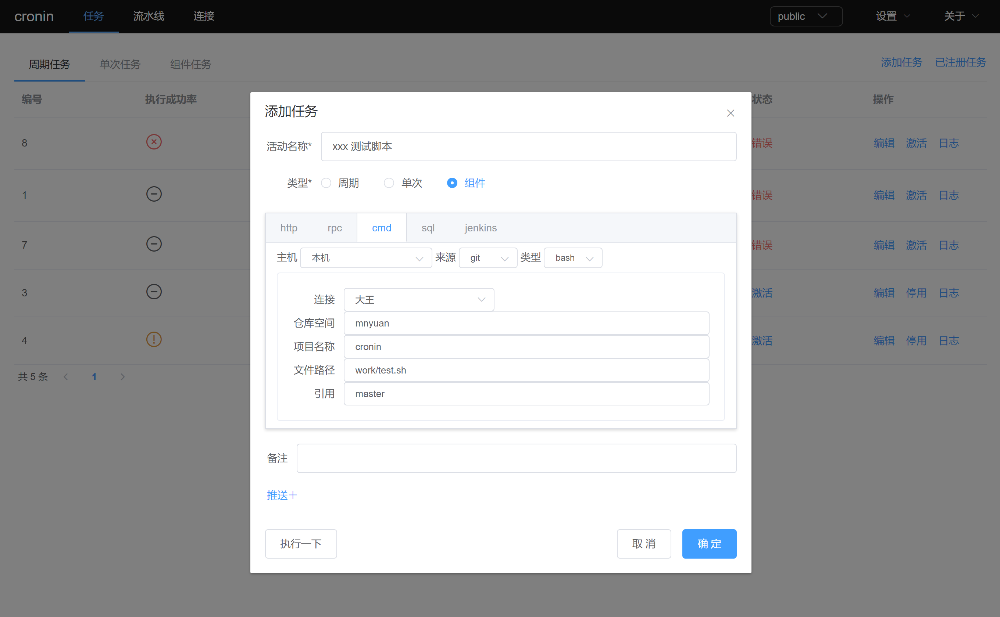


### sql语句任务
sql语句的来源支持表单批量输入、支持git项目拉取.sql文件执行。

> 表单批量sql

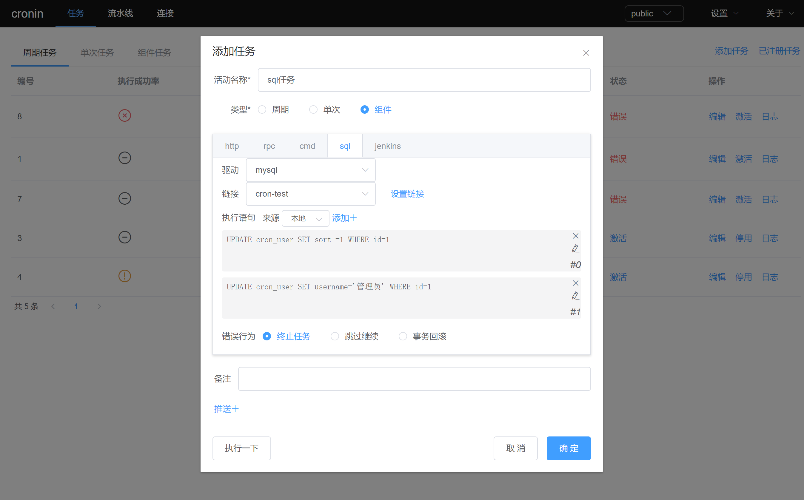

> 表单批量sql 添加，半角;分号会被解析为批量添加时的sql分隔符。

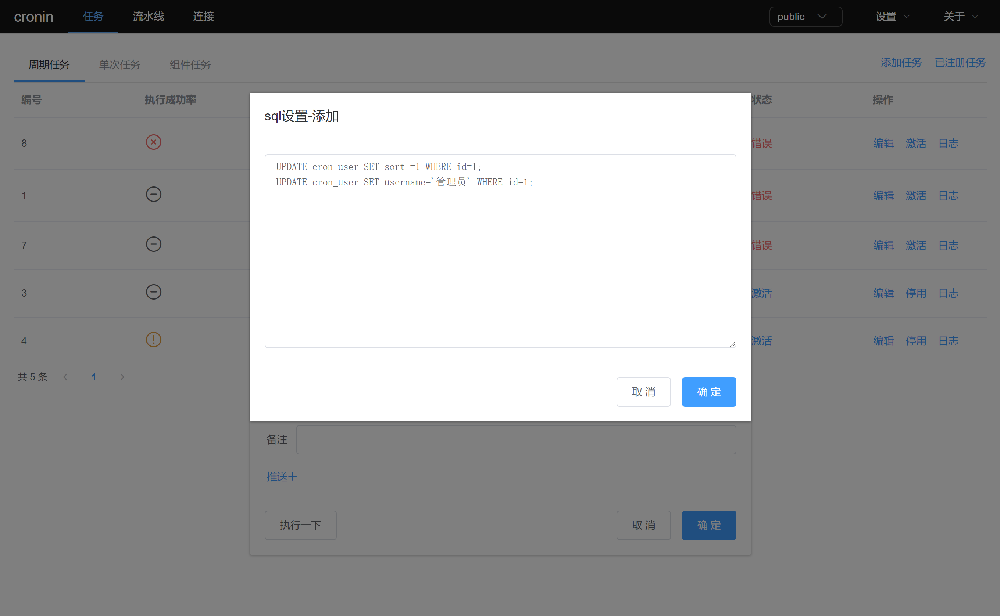

> git项目拉取多个sql文件

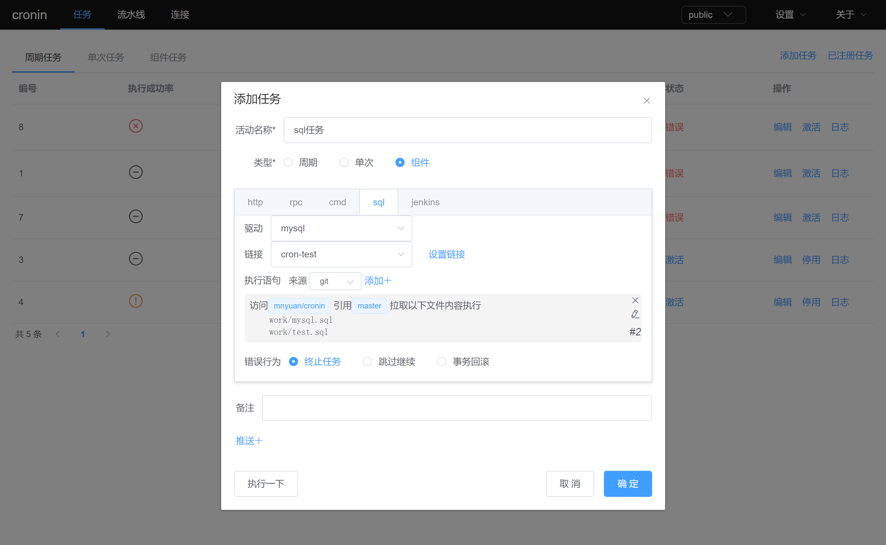
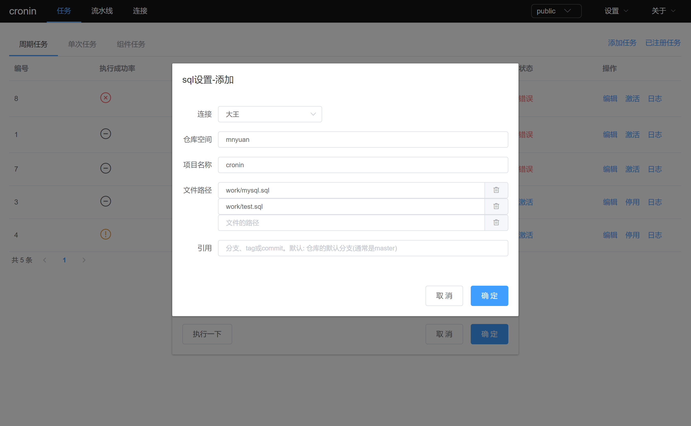


### jenkins 构建任务
jenkins任务中 项目名称为必须，参数根据自身情况可选。

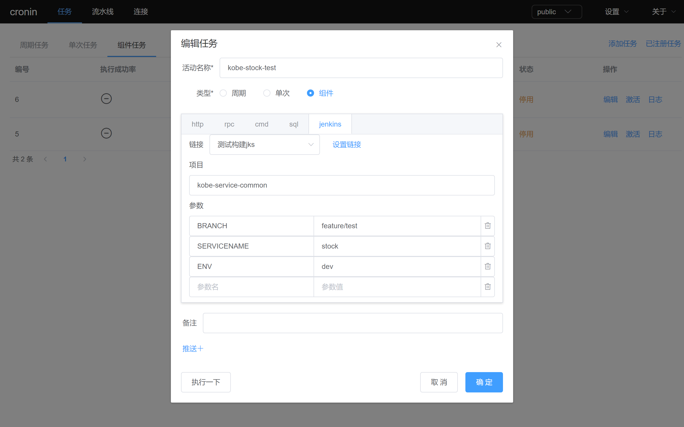