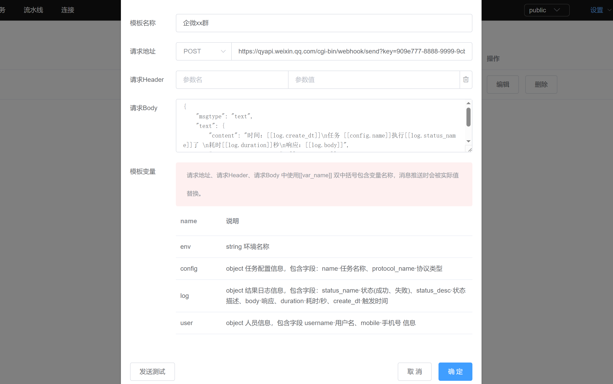

# 消息模板设置

任务执行中可设置消息的发送，发送模板需要在此预先设置。目前支持http 类型的消息发送。
消息中 url、header、body 均可填写双中括号[[name]] 包裹起来的模板变量，执行发送时会被当前值替换。

> 消息模板设置  
>  头部导航: <code>设置</code> / <code>通知</code> 可进入管理界面。

下面图例为企业微信群机器人消息发送模板。
