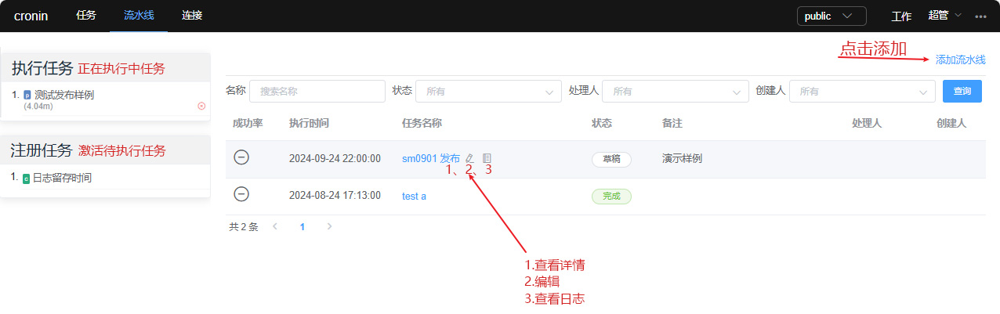
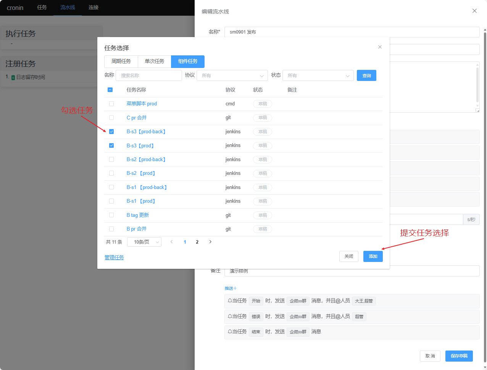
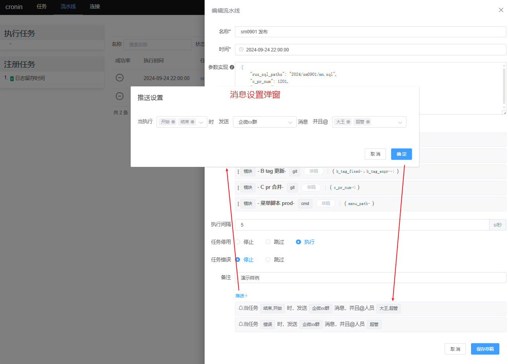
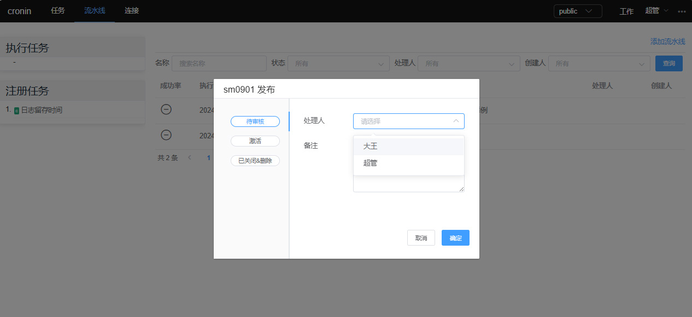
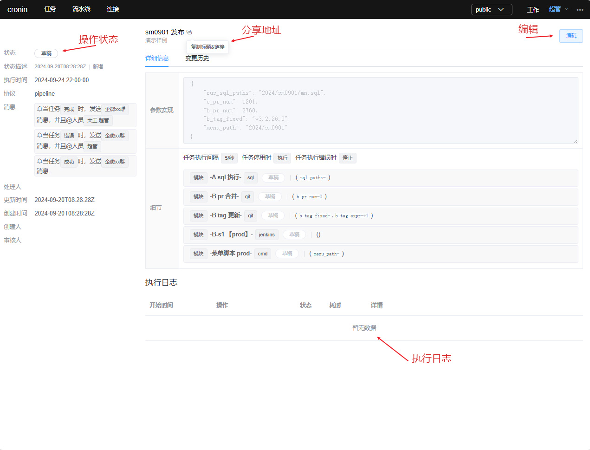

# 流水线设置
将多个任务组件组合到一个工作流程中的任务组合。

> 管理列表
>
流水线任务管理列表，可进行新建流水线任务及详情查看、编辑、日志查看等操作。

> 流水线设置
>
流水线任务设置弹窗，必填信息含：描述名称、执行时间、任务组件选择；可选信息有：参数实现、执行间隔、任务停用、任务执行错误、推送消息等信息设置。

实现的参数会传递给每一个包含的任务，但任务只会取用自己定义过的字段，多余入参忽略，不足入参取本身默认值。

> 选择任务组件
>
相关任务组件需要被提前创建，此处进行选择使用。

> 消息设置
>
当工作流执行到指定阶段时，可以发送消息并@相关人员。

> 状态提交
>
流水线任务设置完成后，可选择指定人员审核或者直接激活任务。

> 流水线详情
>
流水线任务详情展示业务
