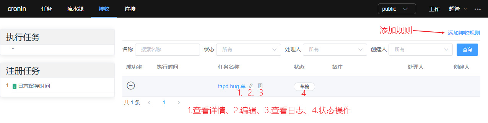
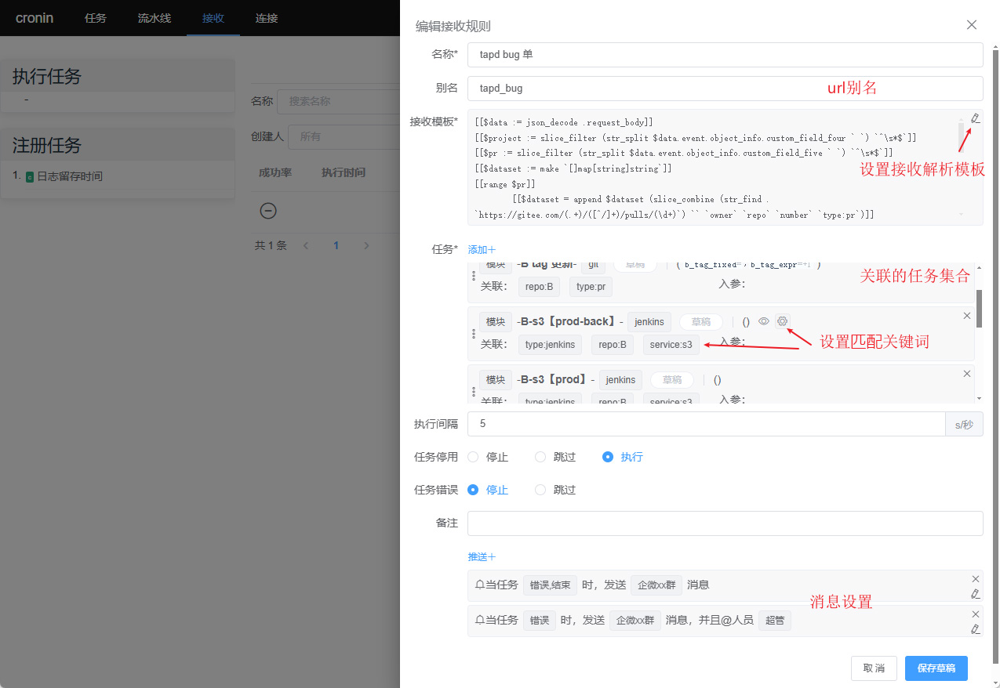
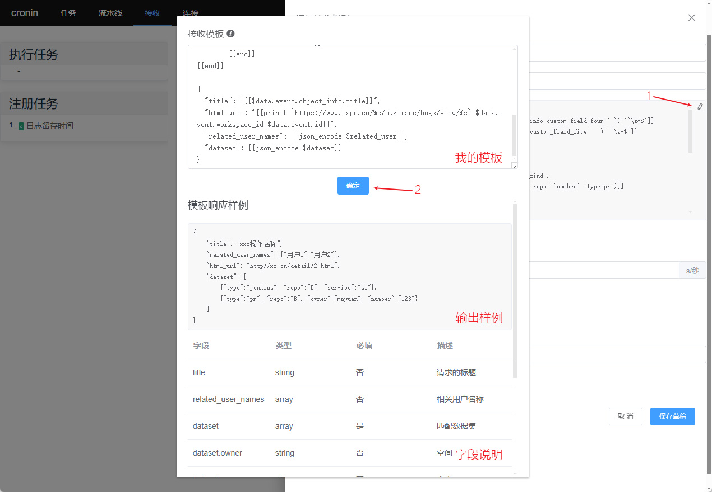
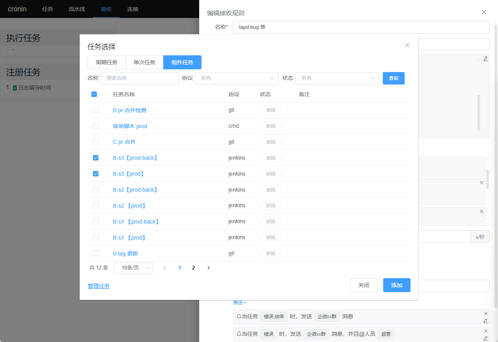
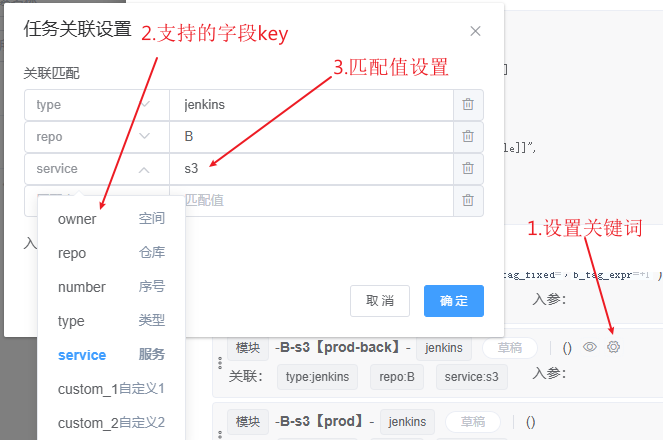
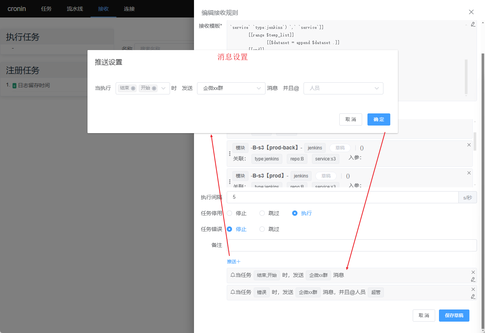
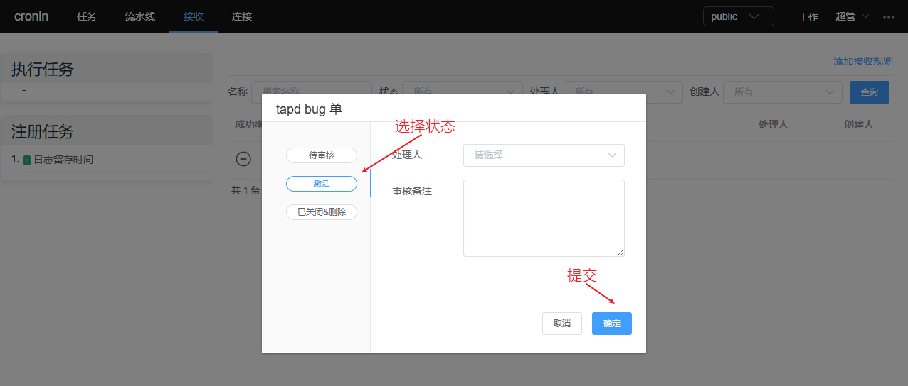
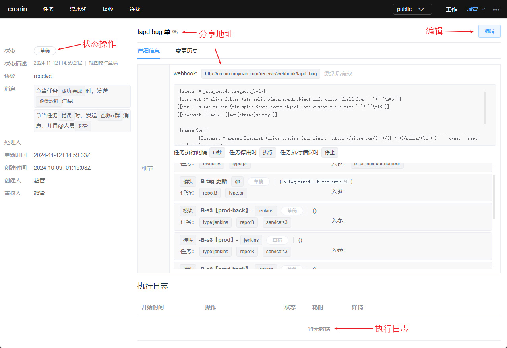

# 接收设置
通过 webhook 接收消息触发执行匹配任务。

> 管理列表
>
接收规则管理列表，可进行新建流水线任务及详情查看、编辑、日志查看等操作。

> 接收设置
>
接收规则设置弹窗，必填信息含：名称、接收模板、关联任务选择；可选信息有：别名、执行间隔、任务停用、任务执行错误、推送消息等信息设置。

接收模板解析后的每一个数据组，都会对一个或多个完全匹配 ‘**关联**’ 关键词的任务进行执行； ‘**入参**’ 关键为可选项，未匹配的以默认值执行。
以下图 <code>B-s3【prod-back】</code> 任务为例，只有数据组条目完全包含 <code>{"type":"jenkins","repo":"B","service":"s3"}</code> 元素时任务才会被执行。

> 接收模板
>
请求的body内容会被 ‘**接收模板**’ 内容进行解析，并输出json结果字符串供后续任务匹配使用。模板语法需符合 Golang text/template 规范，
深度使用案例可以查看 [TAPD与任务平台对接实现自动发bug单](https://juejin.cn/post/7436005907857047615)

> 选择任务组件
>
相关任务组件需要被提前创建，此处进行选择使用。

> 关联关键词
>

> 消息设置
>
当工作流执行到指定阶段时，可以发送消息并@相关人员。

> 状态提交
>
接收规则设置完成后，可选择激活或指定其他人员审核。

> 流水线详情
>
接收规则详情展示业务
